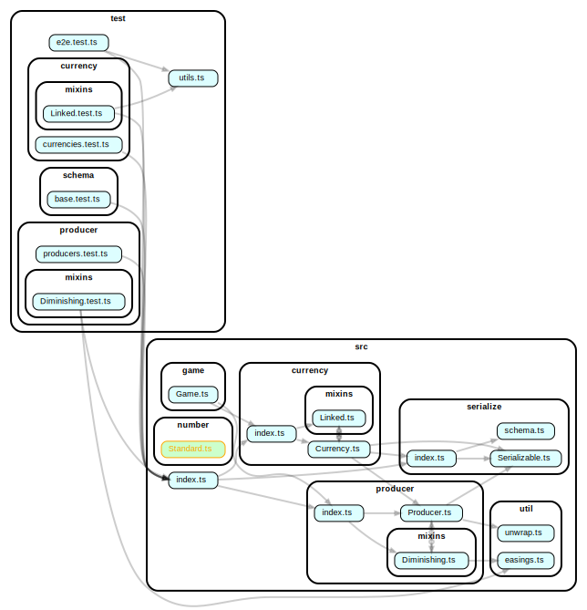

# IncrementalKit

Make incremental games without having to remake the wheel.

## A little example

```ts
const game = new Game({
	tps: 10,
}).start();

const coins = game.createCurrency([], {
	amount: 0,
	name: "coins",
});

coins.addProducer(1);
// `coins` is now going up by 1 per sec.
```


